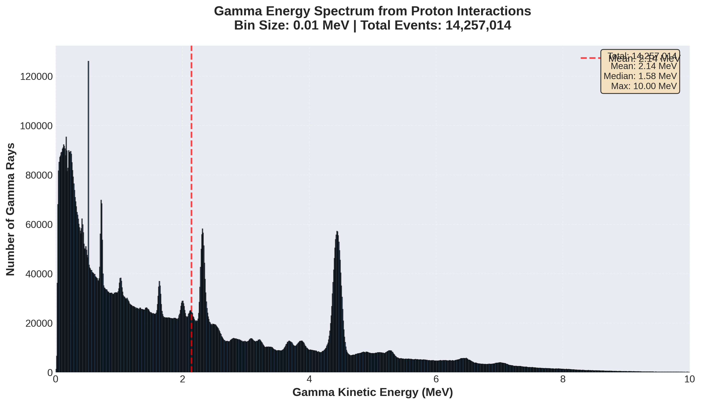

This repository contains analysis and simulation work related to prompt gamma emission in proton therapy and its correlation with bragg peak position for proton range verification. 
This study is based on Monte Carlo simulations (Geant4) and python based anlaysis focusing on prompt gamma lines produced during proton matter nuclear interactions. 
The work explores the spatial correlation between prompt gamma emission profiles and the bragg peak for different proton beams. 
Prompt gamma radiation arises from the inelastic nuclear interactions between incident proton and target nuclei in the medium. 

Simulation Details:
Primary particles used are protons. 
Target is the water phantom having dimension 8.5*8.5*55 cm3. 
Cylindrical detectors are placed along the z axis surrounding the water phantom. 
Original gamma emission position, detector hit position and energy are detected

Analysis workflow:
When proton beam is incident on water, production of prompt gamma happens. The output is being stored in CSV files. 
Then python analysis is performed to extract energy distribution and depth profile. 
## Prompt Gamma Energy Distribution

